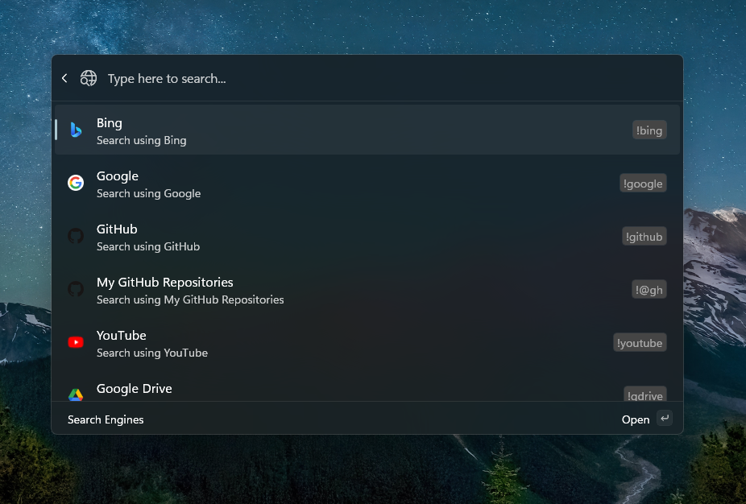

# `SearchEngines` Extension for PowerToys Command Palette

> [!CAUTION]
> WORK-IN-PROGRESS

`SearchEngines` is an extension for the Microsoft PowerToys Command Palette that allows you to quickly search the web using search engines.

---

## Features

-   **Search Ranking:** The extension uses fuzzy matching to rank search engines based on your query. It matches against both the engine's name and its shortcut, providing more relevant results.

-   **Flexible Shortcut Usage:** You can use search engine shortcuts (e.g., `!g` for Google) anywhere within your search query. The extension automatically detects and uses the shortcut to prioritize the relevant search engine.

-   **Favicon Support:** Search results display favicons for each search engine. The extension attempts to automatically discover favicons if they are not explicitly defined in the configuration.

-   **Custom Query Parameters:** Add custom query parameters to your searches using the `&key=value` or `&key` (for flags) syntax directly in your query (e.g., `!gh my search &language=rust &type=repositories`).

-   **Easy Configuration Access:** A subcommand, "Open Configuration File," is available from the main "Search Engines" command. This allows you to quickly open the `SearchEngines.json` configuration file for edits.

## Usage

1.  **Open Command Palette:** Launch the PowerToys Command Palette.
2.  **Activate Extension:** Type `Search Engines` and select the main command.
3.  **Search:**
    *   **General Search:** Type your search query (e.g., `how to code`). The extension intelligently ranks search engines based on your input.
    *   **Using Shortcuts:** Include a shortcut (e.g., `!g`) anywhere in your query to prioritize a specific search engine (e.g., `how to code !g`).
    *   **Custom Parameters:** Add `&key=value` or `&key` to your query for additional parameters (e.g., `my query &lang=en &strict`).
4.  **Open Configuration:** Select the "Open Configuration File" subcommand to edit your `SearchEngines.json` file.

## Configuration

Search engines are configured in the `SearchEngines.json` file, located in `%LOCALAPPDATA%\CommandPaletteExtension-SearchEngines\`.

---

## License

The project is licensed under the [MIT License](./LICENSE)
